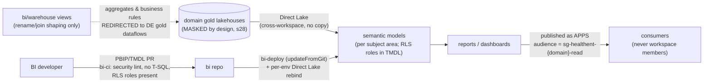

# `bi` repo - Semantic Models & Reports (ADR-37 as amended)

Power BI artifacts in **PBIP project format**, deployed by CI/CD (`fabric-cicd`).
Moved out of the platform repo: BI has its own audience (BI developers / analysts)
and lifecycle, separate from framework code and DE dataflows.

> **Start here:** `docs/runbooks/bi-developer-runbook.md` (deep step-by-step: onboard a new model/dashboard
> via 3 approaches, CI/CD, refresh, security, migration, risks, do/don't, worked example) ·
> `docs/bi/bi-operating-model.md` (policy) · `semantic-models/MODEL-REGISTER.md` (which dataflows ->
> which subject-area models + dashboards).

## Layout

| Path | Contents |
|---|---|
| `semantic-models/{domain}/{SubjectArea}.SemanticModel/` | one model **per business subject area** - endorsed/certified, central measures, RLS roles matching Entra groups |
| `reports/{domain}/{ReportName}.Report/` | reports/dashboards bound to the domain's models |
| `warehouse/{domain}/*.sql` | **BI-authored** serving views + reporting/aggregation tables for the domain warehouse (ADR-38 refinement). **Security DDL is forbidden here** - RLS/CLS/DDM/grants are framework-generated and live in `platform/warehouse` (ADR-33); the pipeline's **security lint fails the build** on any `SECURITY POLICY / GRANT / DENY / MASKED WITH / ALTER AUTHORIZATION` |
| `pipelines/pl-bi-sync.yml` | selective CI/CD: `env` + `domain` + `scope` (SemanticModel / Report / **Warehouse** / Both / All) + optional `item` |

## Test automation (in `pl-bi-sync`)
| Test | When | Fails on |
|---|---|---|
| **Security lint** | before any Warehouse deploy | security DDL in BI SQL |
| **Best Practice Analyzer** (Tabular Editor CLI) | before publishing semantic models | BPA violations severity ≥ 2 |
*(Post-deploy DAX smoke tests - Phase 6/13 addition.)* BI-authored tables derive from the
**masked Gold contract** (BI identities hold no UNMASK), so persisted derivations stay masked -
still: never join toward re-identification (§37).

## Rules (locked)

- **Model per subject area, never per dataflow** (ADR-36 §7) - `dag_uid` is a delivery/audit
  unit; the BI selectivity key is **domain + item**.
- **Few, certified models per domain**; KPI/measure definitions live in the model, not per-report
  (clinical-safety: numbers must not diverge between reports).
- **Direct Lake default** (§3.5); the connection is **env-specific - rebind post-deploy**
  (fabric-cicd parameterisation; VERIFY at first run).
- **RLS/OLS per model** matching `sg-healthent-{domain}-{role}`; sensitivity labels on PHI models;
  cross-domain analytics only via OneLake shortcuts into `shared/` with separate sign-off (§37).
- No per-env values in repo content - env comes from the pipeline run + variable groups.
- Licensing: F64+ Prod = free viewer consumption; below F64 viewers need Pro/PPU (§8/§24).

## High-level data flow & integration

**Boundary:** DEs own anything that creates numbers; BI owns anything that presents them
(bi-operating-model.md §1A). CI/CD YAMLs live centrally in the platform repo
(`devops/pipelines/bi-*`).
