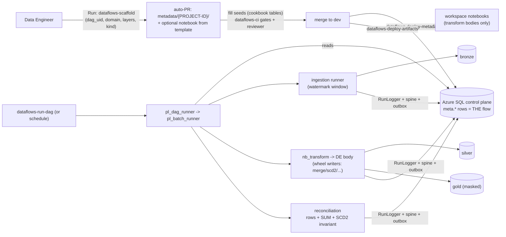

# `dataflows` repo - Data Engineer Development (ADR-37 as amended)

The single DE development repo: **layer folders + one folder set per flow**, keyed by the
flow's **`dag_uid`** (`meta.dag.dag_uid`, ADR-34). Consolidated from the earlier 4-repo
Fabric-Dev design (2026-06-10): same DE experience, **one PR per flow**, simpler CI/CD.
Lives in the single ADO project **Fabric** alongside docs / infra / platform / sql / bi.

## Layout

| Path | Contents | Deployed by |
|---|---|---|
| `bronze/ silver/ gold/` → `DDL/{PROJECT-ID}/NN_{object_name}.sql (banded: 00 setup, 10s dims, 20s facts, 30s views, 40s procs)` | T-SQL for the Warehouse SQL endpoint (e.g. Gold serving views) | `pl-flow-sync` (scope=DDL/Both) |
| `bronze/ silver/ gold/` → `Notebook/{PROJECT-ID}/{Lyr}{Domain}{Entity}{ProjCode}.py (Optus: SlvrAudlgyApptAud001.py)` | PySpark/Spark-SQL notebooks invoked via `nb_transform` + `meta.proc_*` | `pl-flow-sync` (scope=Notebook/Both) |
| `metadata/{PROJECT-ID}/` | `manifest.yml` + ordered idempotent **MERGE** seeds for `meta.*` rows (dag → batch → job → proc → proc_param, objects + columns + DQ) | `pl-metadata-sync` |
| `devops/pipelines/` | this repo's CI/CD YAMLs (incl. `pl-new-dataflow` self-service scaffold + `pl-test-harness`) | - |
| `templates/notebooks/` | copy-from silver/gold notebook templates (W7 + wheel + writers + RunLogger) | - |
| `tests/scenarios/` | deterministic mock-data scenario library (`core10.yml`, pl-test-harness) | - |
| `scripts/` | scaffolder, mock-data generator, harness helpers | - |
| `docs/` | **metadata-cookbook** (entry reference) + **de-onboarding-runbook** (process, anti-patterns, pipeline chooser, workspaces) | - |

## The ONE rule + reserved folders (compliance audit 2026-06-11: layer/metadata folders 100% clean)

**Every PROJECT artifact lives under its `dag_uid`** - same id in repo folders, `meta.dag`,
CI parameters, runtime trigger. The folders above (`devops/ templates/ tests/ scripts/ docs/`)
are **reserved repo infrastructure**, deliberately not per-project: a template becomes a
project file only when copied INTO a `{dag_uid}` folder. Anything in `bronze|silver|gold/` or
`metadata/` not under a `{dag_uid}` is a violation - review-blocking (CI lint Phase 9).

**Bronze note:** ingestion is **metadata-only** (ADR-34) - most flows have *no* bronze
code; those folders exist for exceptional cases. Lakehouse Delta tables are created by
the framework via the **ADR-36 resolver** - never hardcode `abfss` paths; no per-env
files in this repo (env resolves at run time from the control plane).

## Starting a new flow

> **New to the project? Start with [docs/new-project-quickstart.md](docs/new-project-quickstart.md)** - the full first-day walkthrough (scaffold -> PR -> deploy -> run -> FAQ).

| Step | Action |
|---|---|
| 1 | Pick a `dag_uid` - lowercase snake_case, stable forever (e.g. `df_audiology_appointments`) |
| 2 | `python scripts/new_dataflow.py --dag-uid <uid> --domain <d> --kind <ingestion\|transformation\|extraction> --layers bronze,silver,gold` |
| 3 | Complete `metadata/{uid}/` seeds; write notebooks/DDL in the layer folders (transform/extraction only) |
| 4 | One PR (branch protection §25) |
| 5 | Run `pl-metadata-sync` → `pl-flow-sync` → `pl-dag-trigger`, each with `env` + `dag_uid` |

## CI/CD - all selective by mandatory `dag_uid`, never repo-wide

| Pipeline | Parameters | Action |
|---|---|---|
| `dataflows-deploy-metadata` | `env`, `dag_uid` | `metadata/{PROJECT-ID}/*.sql` (ordered) → control DB of `env`; post-checks dag registration |
| `dataflows-deploy-artifacts` | `env`, `dag_uid`, `scope` (DDL/Notebook/Both), `layers` | only `{layer}/{scope}/{dag_uid}/` → sqlcmd → SQL endpoint / `fabric-cicd` → workspace |
| `dataflows-run-dag` | `env`, `dag_uid`, `wait_for_completion` | generic runner via Fabric REST `jobs/instances`; optional poll-to-terminal |

Semantic models & reports are **not** here - they live in the **`bi` repo** (model per
subject area, never per dataflow - ADR-36 §7).

## Verify at first live run (ADR-37)
sqlcmd AAD-SP auth on the control-DB private path · `fabric-cicd` notebook item format
(`.platform` wrapper) · Fabric `jobs/instances` parameter payload shape.

## High-level data flow (a DE's flow, end to end)

**One `dag_uid` = one PR = one runnable flow.** No pipelines are ever authored here -
the generic runners execute everything from metadata (§15.9). CI/CD YAMLs live centrally
in the platform repo (`devops/pipelines/dataflows-*`).
