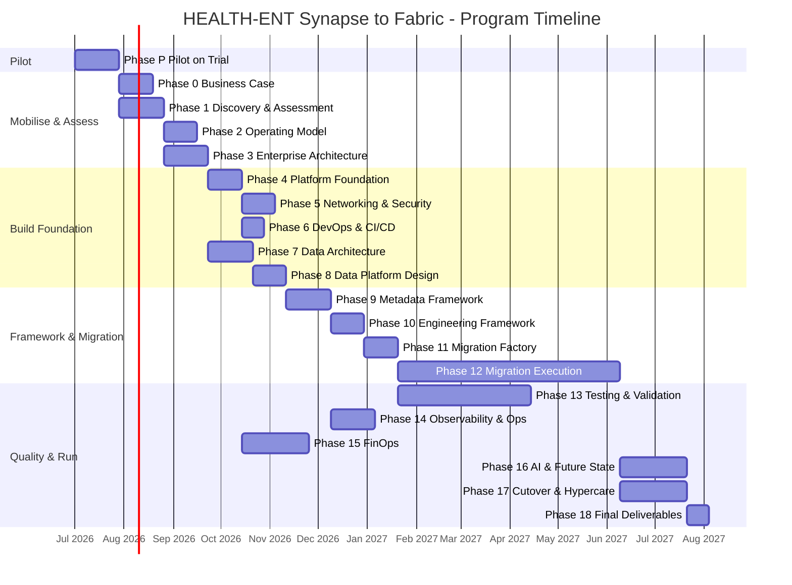

# HEALTH-ENT - Enterprise Fabric Transformation | Master Gameplan

> **Read this file in full before generating any code, infrastructure, or documentation.**
> `CLAUDE.md` gives permanent rules; this file gives the mission, phases, and what to build. Treat every locked decision as a constraint, not a debate.
>
> **Delivered across four repos** (see `CLAUDE.md §10`): `docs`, `infra`, `platform`, `sql`. **Every phase produces three docs** in the docs repo - `implementation.md`, `finops.md`, `risk.md` (`CLAUDE.md §34`) - plus its technical deliverables.

---

## 0. Your Role
Technical co-owner. Design before code; produce production-grade artifacts; work one phase at a time behind its exit gate; flag risk/cost/compliance proactively; ask one focused question when ambiguous; never guess on PHI, security boundaries, or data residency.

---

## 1. Program Overview
Enterprise migration of a national AU audiology provider from **Azure Synapse** to **Microsoft Fabric** - not a lift-and-shift but a full platform transformation (platform engineering, data architecture, data engineering, DevOps/IaC, security & compliance, governance, FinOps, AI/future state, operating model).
**Scale:** 300-500 Synapse pipelines, dedicated + serverless SQL pools, Spark, Power BI, D365, domains Clinical/Finance/Operations/HR/Audiology/Dynamics.
**Residency:** Australia only - AU East primary, AU Southeast DR. **Compliance:** Privacy Act 1988, My Health Records Act 2012, ISO 27001.

---

## 2. Locked Decisions
| Concern | Decision |
|---|---|
| Target platform | Microsoft Fabric - Lakehouse, Warehouse (serving only), Pipelines, Eventstream |
| **Control plane** | **Azure SQL Database** for `meta.*`/`log.*` (ADR-22) - Fabric Warehouse won't enforce constraints |
| **Spark runtime** | **Runtime 1.3 - Spark 3.5 / Python 3.11 / Delta 3.2** (ADR-24) |
| Storage | OneLake - single logical store |
| Medallion | Bronze → Silver → Gold (Delta) |
| Migration approach | Rationalise & redesign - not one-for-one |
| Orchestration | Fabric Data Pipelines, metadata-driven, flat ForEach ×2 |
| Power BI | Direct Lake default; F64+ Prod = free viewer consumption |
| IaC | Terraform (`microsoft/fabric` + `azurerm`); capacity via azurerm |
| CI/CD | Azure DevOps + Fabric Git integration + Deployment Pipelines |
| **Repos** | **Four** - docs / infra / platform / sql (ADR-23) |
| **Capacity** | **Validate on trial first (Phase P), then size paid F-SKUs** (ADR-21/25) |
| Cost lever | **Pause** non-prod capacity; destroy only for weekly drift check (ADR-26) |
| Environments | Pilot → Dev → Test → Prod (+DR) |
| PHI | Never raw in Gold serving; RLS + OLS; masked/aggregated |
| Decommission | Synapse off only after 30-day clean hypercare; parallel run mandatory |

---

## 3. High-Level Timeline (Gantt)

> Indicative durations for planning; refine against Phase 1 discovery. Migration execution (Phase 12 waves) is the long pole and overlaps testing.

> **Dependency note:** Phase 2 (Operating Model) starts after Phase 1 (Discovery), not after Phase 0 - the operating model needs the asset inventory. Phase 0 (Business Case) runs in parallel from Phase P sign-off. The Gantt and text entry criteria are the authoritative sources; they are aligned above.

> **⚠️ STAFFING CAVEAT (amendment 2026-06, R-18 - read before quoting any date):** This Gantt assumes **parallel workstreams** (multiple phases overlapping: e.g. P6/P7/P15 all run off Phase 4; P13 overlaps P12 for 12 weeks). The actual delivery team is **effectively one Senior DE plus a DE Manager**. With one builder, overlapping phases **serialise** - the calendar end date is **not** achievable as drawn, and several "parallel" bars become sequential. Before this timeline is shared with stakeholders or used for funding, **either** (a) resource the parallel tracks (additional engineers per overlapping section), **or** (b) re-baseline the Gantt as a serial plan and accept the longer end date. The dependency *arrows* remain correct; the **wall-clock duration does not**. This is the program's single largest delivery risk and cannot be closed by editing this document - it needs a resourcing decision (see §6 R-18).

---

## 4. Pre-Flight Checklist
- [ ] Four repos created (`healthent-fabric-{docs,infra,platform,sql}`); `CLAUDE.md` in each; `.gitignore` committed
- [ ] `CLAUDE.local.md` filled locally in each repo (see `CLAUDE.md §35`)
- [ ] Azure subscription confirmed - AU East available
- [ ] **Phase P only needs the Fabric free trial** - no paid quota yet. Paid F-SKU quota (F4/F8/F64) requested **after** Phase P sizing
- [ ] Azure DevOps org + project + variable groups created
- [ ] Entra tenant admin access (groups + SP creation)
- [ ] `infra/bootstrap` applied - state backend with `prevent_destroy`
- [ ] `docs/decisions/adr-index.md` + `session-log.md` initialised; `docs/timeline/gantt.md` created

---

## 5. Phases

Each phase below has: **Objective · Implementation Steps · Deliverables (→repo) · FinOps · Risks · Entry/Exit.** Build in order behind each exit gate.

---

### PHASE P - Pilot on Trial Capacity  *(precedes paid spend - ADR-25)*
**Objective:** Prove the framework end-to-end on ONE 60-day trial capacity and produce the F-SKU recommendation Hearing Australia asked for.

> **Sequencing note (amendment 2026-06, G-13 - resolves a circular dependency):** Phase P proves "the framework end-to-end," but the metadata-driven framework is not built until Phase 9/10. Phase P therefore builds a **deliberately thin slice (v0)** of the framework - the *minimum* control-plane DDL, one controller pipeline, and the watermark + reconciliation notebooks needed to run one domain end-to-end. This v0 is a **throwaway/seed prototype**, not the production framework. Phases 9 and 10 build the **hardened** framework; they may discard or refactor the Phase P v0. Treat the Phase P slice as a *spike to validate sizing and approach*, and do not let production framework decisions get locked in here. Capture anything learned as input to Phase 9, not as finished design.

> **Early spikes (amendment 2026-06, G-14 - pull two Wave-0 risks forward):** Two 🔴 risks are currently slated for first proof at Wave-0 (Phase 9), which is far too late to discover a dead end: **R-01 (Fabric DDM ≠ Databricks MASK, ADR-19)** and **R-02 (D365/Dataverse path, ADR-20)**. Run **lightweight spikes for both during Phase P** on the trial capacity: (a) apply Fabric Dynamic Data Masking to one masked column and confirm the syntax/behaviour vs the Synapse/Databricks baseline; (b) stand up one Dataverse→Fabric path and load one entity end-to-end - **and explicitly evaluate Dataverse "Link to Fabric" (zero-copy shortcut) vs a Copy/pipeline ingestion** (feeds ADR-31). These spikes do not need to be production-grade; they exist to convert two unknowns into knowns before any paid spend or framework build.

> **Sizing contingency (amendment 2026-06, G-16 - decide the escalation path *before* you measure):** Phase P's whole purpose is to produce an F-SKU recommendation, but there is no defined path for the case where **the measured recommendation exceeds the budget envelope, or F64 proves insufficient under representative load.** Before running the load test, agree the decision gate: if the estimator's recommended SKU (with headroom) lands above the funded envelope, **or** if F64 cannot sustain the representative slice within throttling limits, **stop and escalate to the CTO + DE Manager** for a scope/budget decision **before** Phase 0 business-casing proceeds on an assumed number. Record the agreed budget ceiling in `CLAUDE.local.md` so the gate is unambiguous at measurement time.

**Implementation steps:**
1. Activate the **Fabric free trial from within Fabric** (Account manager → Start trial) - **not** via the Azure portal (Azure is only for *paid* F-SKUs, not yet). Pick **AU East** region (cannot move later without deleting items). Upgrade the trial to **F64** for representative testing.
2. Create one workspace `healthent-pilot` and attach it to the trial capacity; provision one **control-plane Azure SQL DB** (`sqldb-healthent-control-pilot`) + one Lakehouse + one Warehouse. (Manual / `fab` CLI - not full Terraform yet.) **The workspace - not the capacity - is the durable unit; all upgrade later happens by swapping the capacity underneath it.**
3. Deploy the metadata DDL (sql repo `control-plane/`, order 01-10) to the Azure SQL DB via `sqlpackage`.
4. Deploy framework notebooks (platform repo `notebooks/framework/`) + the metadata-driven controller pipeline.
5. Pick **1 pilot domain (Audiology)**, onboard ~10-20 objects by config (4 inserts each), run full Bronze→Silver→Gold incl. SCD2 + reconciliation.
6. **Build `scripts/capacity_estimator.py`** - inputs: raw CU telemetry CSV from the Fabric Capacity Metrics app; outputs: sustained/peak CU profile, smallest F-SKU with ~25-30% headroom, PAYG vs Reserved cost comparison, F64 viewer-licensing threshold note. **(amendment 2026-06, G-19)** The estimator must **not** size on a naïve sustained/peak average alone - Fabric capacity behaviour is governed by **CU smoothing (carry-forward), throttling stages (interactive delay → interactive rejection → background rejection), and bursting**. Model the **smoothed** utilisation curve (not raw spikes), split demand into **interactive vs background** classes (they throttle differently and at different thresholds), and report **time-above-throttle-threshold** rather than just peak CU. A workload that fits "on peak" can still throttle once smoothing windows fill; the recommendation must reflect that.
7. Run a **scaled load test** (subset of the Wave-0 confirmations) and capture **CU telemetry** from the Fabric Capacity Metrics app.
8. Run `scripts/capacity_estimator.py` against the captured telemetry to produce the F-SKU recommendation.

**Deliverables:** `docs/phase-P/{implementation,finops,risk}.md`; `docs/phase-P/capacity-recommendation.md` (the sizing deliverable); pilot framework in platform/sql repos; `scripts/capacity_estimator.py` in infra repo.

**FinOps:** $0 compute (trial). Output IS the FinOps artifact - the measured F-SKU recommendation + cost compare that gates all paid spend. Partially closes ADR-21/R-03 cheaply.

**Risks:** trial ≤5/tenant & non-reactivatable (don't waste activations); wrong region locks items; trial throttling can skew sizing (note headroom).

**Entry:** repos + trial available; `CLAUDE.local.md` filled (see §35); pre-phase checklist complete (§4). **Exit:** parity passes on the slice; CU telemetry captured; capacity recommendation **signed off** → unlocks paid quota request.

> **Trial → paid upgrade path (no in-place upgrade exists):** a trial capacity is never "converted" to paid. When sized (Phase 4), create the paid **F-SKU in the Azure portal / Terraform** in the **same region (AU East)**, then **reassign the `healthent-pilot` workspace** from the trial capacity to the new paid capacity. The workspace, Lakehouse, Warehouse, and OneLake data all survive the reassignment - only the compute swaps. Keep everything in the workspace (not floating on the capacity) so the swap is clean.

---

### PHASE 0 - Business Case & Mobilisation
**Objective:** Governance, funding, stakeholder alignment, vision.
**Implementation steps:** confirm sponsor + funding; draft business case using **Phase P cost evidence**; define benefits framework + KPIs; build stakeholder map + RACI + governance model; stand up steering cadence; seed program risk register.
**Deliverables (→docs):** executive-summary, business-case, transformation-vision, benefits-realisation, stakeholder-map, governance-model, program-roadmap, raci, risk-register; `phase-00/{implementation,finops,risk}.md`.
**FinOps:** program budget envelope; TCO Synapse-as-is vs Fabric target (seeded from Phase P).
**Risks:** funding/sponsorship slip (High); benefits not measurable (Med) - fix via KPI baselines.
**Entry:** Phase P signed off. **Exit:** steering sign-off on business case + roadmap.

---

### PHASE 1 - Discovery & Assessment
**Objective:** Full inventory + current-state baseline of all Synapse assets.
**Implementation steps:** run `scripts/discovery/inventory_synapse.py` (pipelines, pools, notebooks, linked services, serverless objects); **emit the machine-readable dictionaries (ADR-45): source DATA dictionary per object (volumetrics, columns + PII/PHI classification, update pattern/watermark candidate, lineage, family, traps) + platform dictionary per asset (config, dependencies, disposition) - spec `docs/migration/migration-dictionary-spec.md`; generated by script, human-reviewed only for classification flags**; build dependency matrix; score complexity + migration readiness; capture tech-debt; flag compatibility traps early (`datetimeoffset`, DDM/MASK, Data Explorer if any).
**Deliverables (→docs + infra script):** asset-inventory **(as the platform dictionary)**, **source data dictionary w/ volumetrics (ADR-45)**, dependency-matrix, complexity-assessment, migration-readiness, current-state-architecture, technical-debt-register; `phase-01/{implementation,finops,risk}.md`.
**FinOps:** current Synapse run-cost baseline (DWU + Spark + pipeline + storage) for later delta.
**Risks:** incomplete inventory → mis-sized waves (High); hidden cross-domain dependencies (Med).
**Entry:** Phase P done; Synapse read access. **Exit:** inventory signed off; readiness score produced.

---

### PHASE 2 - Target Operating Model
**Objective:** How HEALTH-ENT runs Fabric post-migration.
**Implementation steps:** define platform vs data operating models; domain ownership + data-product model; service catalogue; SLA + support model.
**Deliverables (→docs):** data/platform operating models, domain-ownership, data-product-model, service-catalogue, sla-framework, support-model; `phase-02/{implementation,finops,risk}.md`.
**FinOps:** chargeback/showback model outline (per-domain capacity attribution).
**Risks:** unclear domain ownership stalls Gold sign-offs (Med).
**Entry:** Phase 1 inventory signed off. **Exit:** operating model approved by CTO + DE Manager.

---

### PHASE 3 - Enterprise Architecture
**Objective:** All architecture views + ADRs.
**Implementation steps:** author business/data/application/technology/security/integration/AI views + future-state; one ADR per major decision (incl. ADR-22/23/24).
**Deliverables (→docs):** architecture-principles + 8 view docs + ADR set; `phase-03/{implementation,finops,risk}.md`.
**FinOps:** architecture cost levers documented (Direct Lake vs Import, capacity topology).
**Risks:** architecture churn if ADRs reopened (Med) - enforce locked-decision rule.
**Entry:** Phase 2. **Exit:** Architecture Review Board sign-off.

---

### PHASE 4 - Platform Foundation

> **IMPORTANT (greenfield, 2026-06-20): DEV is a REAL Azure environment, provisioned exactly like Test and
> Prod** - its own resource group, its own real Fabric capacity (per `capacity_mode`/SKU), control DB, Key
> Vaults, identity (SPs + groups), Fabric Environment, and the SAME module composition. The Fabric **trial** is
> ONLY the Phase-P pilot and a $0 cost lever (`capacity_mode=trial` points Dev at the trial via a data-source) -
> it is NOT "Dev". The greenfield package creates Dev in Azure the same way it creates Test/Prod, differing
> ONLY by per-env **config values** (capacity SKU/mode/region, security scope (RLS/OLS/PIM/break-glass),
> networking (private endpoints), residency, retention/purge windows, idle/cost policy, BI viewer licensing,
> KV purge-protection, geo-backup) - never by a different mechanism. **Promotion = same code, different
> `<env>.tfvars` + `config/<target>.json`.** Capacity is one of these per-env parameters, in the same class as
> security: for paid envs the Terraform apply CREATES the capacity AND everything else in one run; only the
> trial is a manual pre-step (it cannot be Terraformed) referenced by data-source. Full portability + the
> "is everything in Azure DevOps?" answer: `docs/runbooks/greenfield-package.md`.

**Objective:** Provision Fabric across envs via Terraform - no portal clicks; rebuildable from repo.
**Implementation steps:** (infra repo) bootstrap state backend; modules `fabric_capacity` (azurerm), `fabric_workspace/lakehouse/warehouse` (microsoft/fabric), `control_sql`; per-env tfvars (Prod `prevent_destroy`); `pause-resume.sh`; validate `terraform plan` clean; test **pause/resume** + weekly destroy/rebuild on Test. **Reassign the `healthent-pilot` workspace from the trial capacity to the new paid F-SKU (same region) - items/data persist.** **Confirm Fabric BCDR pairing** (DR verify, §20).
**Deliverables (→infra + docs):** fabric/capacity/workspace/onelake/lakehouse/warehouse/environment-strategy docs; bootstrap + modules + envs; `phase-04/{implementation,finops,risk}.md`.
**FinOps:** commit paid F-SKUs sized from Phase P; pause schedules live; PAYG→Reserved plan after stabilisation.
**Risks:** R-03 F-SKU sizing (now de-risked by Phase P); Terraform provider preview gaps (Med, §27); KV soft-delete on destroy (Med).
**Entry:** Phase 3; **paid quota approved (post Phase P)**. **Exit:** Dev provisioned via Terraform; `plan` clean all envs; pause/resume + rebuild tested.

---

### PHASE 5 - Networking & Security
**Objective:** Zero-trust identity, automated access, private connectivity.
**Implementation steps:** (infra) Terraform `entra_groups`, `service_principals`, `conditional_access` (MFA), `key_vault` (per domain/env with 30-day + 7-day expiry alerts), `private_endpoints`; (sql) `security/{rls,ols,entra_group_assignments}.sql`; `verify-access.sh` + `tests/security`; confirm cross-domain 403; document secret rotation schedule in `docs/runbooks/secret-rotation.md`.
**Deliverables (→infra/sql/docs):** identity/zero-trust/rbac/rls-ols/private-connectivity/data-residency/key-management/threat-model/security-baseline/secret-rotation-runbook; ADR-19 (open); `phase-05/{implementation,finops,risk}.md`.
**FinOps:** private endpoints + KV cost; PIM for HR.
**Risks:** ADR-19 Fabric DDM syntax (High, closes Wave-0); secret-rotation alert gaps closed this phase.

> **Security amendments (2026-06):**
> - **JIT/PIM for *all* prod PHI domains + break-glass (G-10):** the plan currently scopes PIM to HR only. For a PHI platform, **standing access to any production PHI domain (Clinical, Audiology, and any Gold containing health data) must also be JIT via Entra PIM**, not just HR. Define a **break-glass** account/procedure (emergency elevation, heavily alerted and audited, time-boxed) and document it in `docs/runbooks/break-glass-access.md`. No human should hold permanent standing read access to raw PHI.
> - **Customer-Managed Keys decision (G-11, ADR-28):** explicitly decide **CMK vs Microsoft-Managed Keys** for OneLake, the control-plane Azure SQL DBs, and Key Vaults, and record it as ADR-28. Healthcare/ISO 27001 programs frequently require CMK (customer control of the key lifecycle); deferring this silently bakes in MMK. If CMK is chosen, provision the key hierarchy + rotation in this phase.
> - **Private connectivity scope + control-plane private path (G-12, ADR-32):** Fabric Private Link has **tenant-wide** implications (enabling it affects the whole tenant, not one workspace) - spike and document the blast radius before enabling. Separately, ensure the **control-plane Azure SQL DBs are on a private path** (Private Endpoint, public network access disabled), not just the Fabric items. Record the networking decision as ADR-32.

**Entry:** Phase 4; Entra admin. **Exit:** full apply provisions identity with zero manual steps; access tests pass; cross-domain denied; MFA active; PHI controls verified; KV expiry alerts confirmed firing; **JIT/PIM active for all prod PHI domains; break-glass documented; CMK decision (ADR-28) recorded; control-plane on private path.**

---

### PHASE 6 - DevOps & CI/CD
**Objective:** CI/CD, Git strategy, branching, release governance **across four repos**.
**Implementation steps:** define branch protection per repo (§25); infra-ci/cd (plan→manual apply); sql-ci/cd (build→sqlpackage); platform ci + **Fabric Git integration** (workspace↔platform repo, branch-per-env, Git Folder per workspace) + **Deployment Pipelines**; variable groups per env.
**Deliverables (→all repos + docs):** git/branching/release/promotion/rollback strategies; pipeline YAMLs per repo; `phase-06/{implementation,finops,risk}.md`.
**FinOps:** CI minutes; ephemeral Test env cost via pause.
**Risks:** Fabric Git item coverage gaps → some items need REST (Med); promotion drift across repos (Med).
**Entry:** Phase 5; ADO project. **Exit:** CI/CD green for Dev; promotion Dev→Test validated.

---

### PHASE 7 - Enterprise Data Architecture & Modelling
**Objective:** Full modelling lifecycle, business capability → physical.
**Implementation steps:** conceptual/logical/canonical/physical + lakehouse + dimensional models; semantic-model standards; data domains; master/reference data; data contracts per domain; glossary + dictionary; ERDs (Mermaid) in sql repo `warehouse/.../ddl`.
**Deliverables (→docs/sql):** model docs + data-contracts + glossary; Gold DDL/SCD2 patterns; `phase-07/{implementation,finops,risk}.md`.
**FinOps:** model choices affecting CU (Direct Lake table design, V-Order).
**Risks:** grain/SCD disputes delay Gold (Med).
**Entry:** Phase 6; domain ownership confirmed (Phase 2). **Exit:** model approved by ARB + domain owners.

---

### PHASE 8 - Data Platform Design
**Objective:** Medallion design + processing patterns.
**Implementation steps:** Bronze/Silver/Gold designs; batch + CDC + streaming standards; error-handling, DQ framework (§28), validation standards, replay/recovery; lock **Runtime 1.3** (ADR-24).
**Deliverables (→docs):** layer designs + standards; reference notebooks/SQL templates validated in Dev; `phase-08/{implementation,finops,risk}.md`.
**FinOps:** Spark pool sizing + autoscale; OPTIMIZE/VACUUM policy cost.
**Risks:** streaming scope creep (Med).
**Entry:** Phase 7. **Exit:** design approved; templates validated in Dev.

---

### PHASE 9 - Metadata-Driven Framework  *(Wave-0 gate origin)*
**Objective:** Build the control framework - backbone of every ingestion/transform. New source = config rows only.
**Implementation steps:** (sql repo, **Azure SQL control plane**) DDL 01-10 in FK order; seed inserts pass all FK/CHECK; (platform repo) framework notebooks - watermark, run-lock, drift, circuit-breaker, audit, notification, reconciliation; unit tests; **integration: 400-object load test (Wave-0)**.
**Deliverables (→sql/platform/docs):** metadata DDL, framework notebooks, onboarding guide, watermark rules; unit + Wave-0 tests; `phase-09/{implementation,finops,risk}.md`.
**FinOps:** Wave-0 load test CU profile → confirms Prod sizing under 400-object concurrency.
**Risks:** R-08 Spark concurrency ceiling on F64 (Med); control-plane mis-placed in Warehouse (closed by ADR-22).

> **Control-plane load validation (amendment 2026-06, G-08, R-15-adjacent):** the Wave-0 400-object load test currently proves the **Fabric/Spark** side. It must **also** prove the **Azure SQL control plane** under the same concurrency: 300-500 pipelines hammering `meta.*`/`log.*` simultaneously means **connection-pool pressure (JDBC/ODBC exhaustion), `run_lock`/watermark row contention, and write-throughput on the log tables**. Add an explicit control-plane assertion to Wave-0: confirm the control DB SKU sustains peak concurrent connections without pool exhaustion or lock timeouts, and that the run-lock pattern does not serialise the fan-out. If the control DB throttles, the whole framework stalls regardless of how much Fabric capacity exists.

**Entry:** Phase 8; Warehouse + control SQL in Dev; per-domain KVs. **Exit (Wave-0 "Green at Load"):** DDL clean; seeds pass constraints; unit tests green; 400-object load passes all six confirmations; **control-plane Azure SQL sustains the concurrent load (no connection-pool exhaustion, no run-lock contention/timeouts);** observability fires under injected failure/drift. **Nothing in Phase 10+ starts until this passes.**

---

### PHASE 10 - Data Engineering Framework
**Objective:** Reusable ingestion/CDC/SCD/DQ/reconciliation framework.
**Implementation steps:** (platform repo) `nb_ingestion_full/incremental`, `nb_cdc_processor`, `nb_scd1/scd2_processor`, `nb_dq_validator`, `nb_reconciliation`, `nb_schema_drift_handler`; framework pipelines (controller, bronze→silver, silver→gold); unit + synthetic integration tests in Dev.
**Deliverables (→platform/docs):** framework notebooks + pipelines + tests + user guide; `phase-10/{implementation,finops,risk}.md`.
**FinOps:** per-pattern CU benchmark (full vs incremental vs CDC) to guide wave scheduling.
**Risks:** SCD2 correctness regressions (Med) - invariant test gate; drift false-positives (Low).
**Entry:** Phase 9 passed. **Exit:** framework unit-tested; synthetic integration green in Dev.

---

### PHASE 11 - Migration Factory
**Objective:** Wave planning, rationalisation, automation, validation.
**Implementation steps:** wave plan + prioritisation/complexity matrices **computed from the Phase 1 dictionaries (ADR-45)**; rationalisation decisions (consolidate/modernise/decommission); automation `assess_pipeline.py`, `generate_migration_ticket.py`, `validate_migrated_pipeline.py`, **dictionary→seeds generator (dictionary entry → pre-filled `metadata/{code}/` scaffold - typing becomes reviewing)**; **`meta.migration_object` per-object state register (DDL + seed from dictionary; forward-only state machine, evidence per state - spec §4)**; per-wave validation framework.
**Deliverables (→docs/infra-scripts):** factory design, wave plan, matrices, automation scripts; `phase-11/{implementation,finops,risk}.md`.
**FinOps:** per-wave CU + effort estimate; decommission savings schedule.
**Risks:** under-estimated wave complexity (High); rationalisation disputes (Med).
**Entry:** Phase 10; Phase 1 inventory. **Exit:** Wave 1 plan approved; automation validated on samples.

---

### PHASE 12 - Migration Execution *(long pole; overlaps Testing)*
**Objective:** Execute waves. Each workload → correct Fabric target with the right tool; rationalise, don't lift-and-shift.
**Synapse→Fabric tooling (locked):** Dedicated SQL Pool → Warehouse (Migration Assistant: DACPAC + Copilot fixes + Copy job); Spark/notebooks/SJDs → Data Engineering (Spark Migration Assistant); Synapse pipelines → Data Factory (assess→map→migrate); Serverless/lake DBs → OneLake shortcuts; linked services → Fabric connections; Data Explorer → Eventhouse (REST). IRs eliminated.

**Implementation steps (per wave):** assess → migrate with assistant → rationalise/redesign → onboard via config → parallel run (5 business days) → reconcile (rows + SUM + SCD2) → reroute downstream consumers → cutover → keep rollback ready → decommission Synapse after 30-day clean hypercare. **Tracking is per OBJECT in `meta.migration_object` (ADR-45): states move forward only, each with evidence; an object's legacy counterpart is removed only when ITS state allows it (its own clean 30 days) - never on the wave average. Stragglers stay visible in the register and do not exit with the wave.**

**Wave-0 gate (hard prerequisite for Wave 1+):** Wave-0 ("Green at Load") must pass fully before any Wave-1 work begins. This is the exit gate of Phase 9 - if it is not confirmed closed in `docs/decisions/session-log.md`, stop and verify before continuing.

**Rollback authority and trigger:**
- **Who:** DE Manager (or on-call Senior DE out-of-hours) has sole authority to trigger rollback.
- **Trigger conditions:** reconciliation failure rate > 1% on row count OR > 0.5% on SUM measure; any P1 PHI exposure; pipeline failure rate > 5% in first 24h post-cutover.
- **Rollback window:** connections are rerouted back to Synapse within 1h of trigger; Synapse decommission is blocked until 30-day clean hypercare completes without rollback trigger.
- **Rollback runbook:** `docs/runbooks/cutover-rollback.md` (produced in Phase 11).

**Deliverables (→platform/sql/docs):** migrated pipelines/notebooks/Warehouse DDL; PBI Direct Lake reconnect log; per-wave parallel-run/cutover/rollback/reconciliation + connection-reroute logs; `phase-12/{implementation,finops,risk}.md` per wave.
**FinOps:** running Synapse→Fabric cost crossover tracked per wave; decommission savings realised.
**Risks:** R-01 DDM, R-02 Dataverse, R-06 datetimeoffset, R-07 Direct Lake fallback - all per-object; reconciliation failures block cutover (by design).
**Entry:** Phase 11; **Wave-0 gate passed and confirmed in session-log.** **Exit (per wave):** parallel run clean 5 days → reconciliation signed off → cutover → rollback tested → Synapse decommissioned after 30-day clean hypercare.

---

### PHASE 13 - Testing & Validation
**Objective:** End-to-end testing across layers/envs.
**Implementation steps:** SIT per domain; business UAT scripts; performance query benchmarks; security checklist; per-domain reconciliation; defect triage.
**Deliverables (→platform/docs):** test strategy + SIT/UAT/perf results + defect register; `phase-13/{implementation,finops,risk}.md`.
**FinOps:** perf tuning → CU reduction targets.
**Risks:** UAT defect backlog delays cutover (Med).
**Entry:** Phase 12 Wave 1 done. **Exit:** SIT passed; UAT signed off; perf met; zero critical defects.

---

### PHASE 14 - Observability & Operations
**Objective:** Monitoring, logging, alerting, incident management.
**Implementation steps:** (platform ops notebooks) pipeline_monitor (15m), capacity_monitor (30m), dq_dashboard (daily); ops SQL views; alerting framework + severities; incident runbooks; `fabric_monitoring` Terraform.
**Deliverables (→platform/sql/infra/docs):** monitoring/alerting/incident docs + runbooks + notebooks + views; `phase-14/{implementation,finops,risk}.md`.
**FinOps:** capacity_monitor enforces CU 80/95% alerts feeding cost reviews.
**Risks:** alert fatigue / missing escalation (Med).
**Entry:** Phase 13. **Exit:** dashboards live in UAT; alerting tested; runbooks signed off by ops.

---

### PHASE 15 - FinOps
**Objective:** Cost model, CU capacity planning, chargeback/showback, optimisation.
**Implementation steps:** build cost model from actual CU telemetry; capacity plan + forecast; chargeback/showback per domain; optimisation playbook (pause schedules, Direct Lake, V-Order, OPTIMIZE/VACUUM, Reserved commitment).
**Deliverables (→docs/platform):** cost-model, capacity-planning, forecasting, optimisation-playbook, chargeback/showback; `nb_cost_monitor`, `v_fabric_cu_consumption`; `phase-15/{implementation,finops,risk}.md`.
**FinOps:** this phase IS FinOps - validate model vs actual CU; sign off Reserved purchase.
**Risks:** CU forecast error → over/under-provision (Med) - bounded by telemetry + headroom.
**Entry:** Phase 4 (runs in parallel, finalised here). **Exit:** model validated vs actuals; chargeback approved by finance.

---

### PHASE 16 - AI & Future State
**Objective:** AI/ML future-state architecture on Fabric.

**ML use case selection (resolve before Phase 16 begins):** the demo use case must be chosen and approved by the CTO before Phase 16 starts - it directly determines PHI exposure risk (High, R-14) and data governance requirements. Candidate use cases for a national audiology provider:
- **Appointment no-show prediction** - uses scheduling + demographic data; moderate PHI risk; clear business ROI.
- **Hearing loss progression modelling** - uses audiogram history; high PHI sensitivity; requires HREC consideration.
- **Referral pathway optimisation** - uses referral + outcomes data; moderate PHI risk; operational value.
The chosen use case must be documented as a locked decision (new ADR) before any notebook scaffolding begins.

> **Consent & lawful basis (amendment 2026-06, G-05, R-17-adjacent):** before any PHI is used to train or score a model - even masked/aggregated - confirm the **lawful basis** for that secondary use under the Privacy Act APPs (APP 6 secondary use) and the My Health Records Act, and whether **HREC/ethics review** is required (research vs operational analytics changes the answer). The "hearing loss progression" candidate in particular likely triggers HREC. Patient consent / lawful-basis confirmation is a **design input**, not a post-hoc check - bake it into the use-case ADR (ADR-27) and the feature/governance design, and obtain **clinical governance** sign-off (distinct from CTO/business sign-off).

**Implementation steps:** AI architecture; Fabric AI/Copilot design; ML platform (MLflow) design; real-time analytics design; ML template notebooks (feature eng, training, batch scoring); demo the **approved use case** in Dev with PHI masked/aggregated per §28.
**Deliverables (→docs/platform):** AI/ML/real-time/self-service designs + roadmap + ML templates; approved use case scaffolded + demoed; `phase-16/{implementation,finops,risk}.md`.
**FinOps:** ML compute + Copilot capacity cost.
**Risks:** PHI in ML features (High, R-14) - enforce masking/governance per §28 Gold PHI-mask rule; scope creep (Med); use case not approved before start (High) - resolve at phase entry.
**Entry:** Phase 12 (partial); **use case approved by CTO; ADR logged; lawful basis / HREC position confirmed and clinical-governance sign-off obtained (G-05); de-identification standard defined and applied per ADR-30 (G-04) - masking alone is not de-identification, and audiology data carries real re-identification risk.** **Exit:** AI architecture approved by ARB; approved ML use case scaffolded + demoed.

---

### PHASE 17 - Cutover & Hypercare
**Objective:** Final prod cutover, 30-day hypercare, Synapse decommission.
**Implementation steps:** execute cutover plan; rollback ready (authority + triggers defined in Phase 12); 30-day hypercare support model; decommission Synapse only after clean hypercare; capture exit-criteria sign-off.
**Deliverables (→docs):** cutover/rollback/hypercare/support-transition/synapse-decommission/exit-sign-off; `phase-17/{implementation,finops,risk}.md`.
**FinOps:** realise full Synapse decommission savings; confirm steady-state CU.
**Risks:** post-cutover incidents (High) - hypercare + MTTR targets (§32); premature decommission (High) - gate on clean hypercare; rollback authority unclear (closed by Phase 12 definition).
**Entry:** Phase 16; all waves migrated; UAT signed off; Prod healthy. **Exit:** 30-day hypercare clean; Synapse decommissioned; business sign-off.

---

### PHASE 18 - Final Deliverables
**Objective:** Package the complete transformation pack.
**Implementation steps:** assemble executive/architecture/security/data-model/devops/migration/testing/operations/finops/ai packs + complete repo guide; tag repos `v1.0-transformation-complete`.
**Deliverables (→docs):** all packs + repo guide; `phase-18/{implementation,finops,risk}.md`.
**FinOps:** final TCO realised vs business case; benefits realisation report.
**Risks:** knowledge-transfer gaps (Med) - handover + runbooks.
**Entry:** Phase 17. **Exit:** packs signed off by CTO + Program Director; repos tagged.

---

## 6. Consolidated Program Risk Register
| # | Risk | Sev | Status | Owner | Closes when |
|---|---|---|---|---|---|
| R-01 | Fabric DDM ≠ Databricks MASK (ADR-19) | 🔴 | Open | Senior DE | Wave-0 masking test passes |
| R-02 | D365/Dataverse path unvalidated (ADR-20) | 🔴 | Open | Senior DE | Wave-0 entity loaded end-to-end |
| R-03 | F-SKU sizing for 400-object load (ADR-21) | 🟡 | **De-risked in Phase P** | Senior DE + DE Manager | Wave-0 load on chosen F-SKU passes |
| R-04 | Fabric Terraform provider preview gaps | 🟡 | Open | Senior DE | Per-gap REST runbook (§27) |
| R-05 | KV soft-delete lingers 30 days on destroy | 🟡 | Open | Senior DE | Purge step in destroy script |
| R-06 | datetimeoffset unsupported in Warehouse | 🟡 | Open | Senior DE | Remediated per object in Phase 1/12 |
| R-07 | Direct Lake → DirectQuery fallback under load | 🟡 | Open | Senior DE | Wave-0 BI stress test |
| R-08 | Spark concurrency ceiling under 400-object load | 🟡 | Open | Senior DE | Wave-0 load test |
| R-09 | Secret rotation - no expiry alerts | 🟢 | **Closed Phase 5** | Senior DE | KV expiry alerts confirmed firing (Phase 5 exit) |
| R-10 | SP/MI can't own some items; ownership immutable | 🟡 | Open | Senior DE | Durable owner identity chosen (Phase 4) |
| R-11 | Fabric BCDR pairing assumption (AU SE) | 🟢 | Verify | Senior DE | Phase 4 confirms BCDR model |
| R-12 | Wave complexity under-estimated | 🔴 | Open | DE Manager | Phase 11 matrices + Wave-1 actuals |
| R-13 | Rollback authority undefined at cutover | 🟢 | **Closed Phase 12** | DE Manager | Phase 12 rollback authority + triggers documented |
| R-14 | ML use case not approved before Phase 16 | 🟡 | Open | CTO + Senior DE | Use case ADR logged before Phase 16 entry |
| R-15 | Control-plane Azure SQL is a single point of failure with no defined backup/restore; loss or corruption halts the entire framework | 🔴 | Open | Senior DE | PITR + geo-backup enabled and a restore drill passes (Phase 4 provision, validated by Phase 9); see `CLAUDE.md §20` |
| R-16 | Raw/identifiable PHI leaks into non-prod (Dev/Test/UAT) via test data | 🟠 | Open | Senior DE | Test-data strategy defined (ADR-29): no raw PHI outside Prod; synthetic/de-identified non-prod data verified |
| R-17 | NDB breach-response, retention, and right-to-erasure obligations not designed (incl. Delta time-travel retaining "deleted" PHI) | 🟠 | Open | Senior DE + Privacy/Legal | NDB runbook published; retention/disposal policy set with legal sign-off; erasure honoured through time-travel/VACUUM |
| R-18 | Timeline assumes parallel teams; actual staffing is ~1 engineer - drawn end date is not achievable | 🔴 | Open | DE Manager + CTO | Either parallel tracks resourced, or Gantt re-baselined as serial and accepted |
| R-19 | No contingency if Phase P sizing exceeds budget or F64 proves insufficient | 🟡 | Open | CTO + DE Manager | Budget ceiling + escalation gate agreed and recorded before the Phase P load test |
| R-20 | CMK vs MMK undecided and Private Link tenant-wide blast radius / control-plane private path under-specified | 🟡 | Open | Senior DE | ADR-28 (keys) + ADR-32 (networking) recorded; control-plane on private path (Phase 5) |

> Each phase's `risk.md` rolls up here. Update as risks close or emerge.
> **Amendment 2026-06:** R-15-R-20 added from the program review (`docs/review/program-review.md`). The earlier dangling "R-16" reference in the Phase 16 text was a typo for **R-14** and has been corrected; R-16 now denotes the test-data PHI-leak risk above.

---

## 7. FinOps Summary (program-level)
- **Gate spend on evidence:** no paid capacity until Phase P sizing is signed off.
- **Pause, don't destroy** non-prod (ADR-26); destroy only weekly for IaC-drift check.
- **Crossover tracking** in Phase 12: realise Synapse decommission savings per wave.
- **F64 viewer threshold** may dominate Prod SKU choice independent of compute.
- **Reserved** commitment only after Phase 15 validates the model against actual CU.
- Each phase's `finops.md` rolls up into `docs/finops/cost-model.md`.

---

## 8. Current Status
| Phase | Status | Last updated |
|---|---|---|
| P - Pilot on Trial | 🟢 **ENTERED 2026-06-10; step 4 ingestion E2E ✅ GREEN 2026-06-11** - run a3e20391: rows_copied=4, write_confirmed=1, watermark advanced (epoch→source MAX), lock released, breaker 0 (§15.5 proven live). Root cause of all prior failures = **H8: `%run` library's parameters cell clobbered injected job parameters** (fix: `globals().get` defaults + parameters-cell standards + preflight fail-fast - ADR-42 W6/W7). **ADR-41** (source-family ingestion: Dataverse/OData/SQL/file-landing/REST + drift_policy + admission control) and **ADR-42** (capacity topology, scheduled SKU scaling, intraday workspace-shifting REJECTED) accepted from stakeholder review; `source-platform-profile.md` reconciles JD (Serverless+ADLS only) vs interview (Fabric migration is the real mandate; R-18 amplified by BAU duty). Trial ACTIVE (FTL4 ~F4-class P-R11, AU East, 2/5 trials); control DB serverless AAD-only; DDL 23/23, seeds 8/8, gates 6/6; 9 notebooks deployed (incl. param probe). NEXT: silver→scd2→recon chain · idempotency re-run · DDM + Dataverse spikes · **R-19 ceiling (user) gates load test** · telemetry → estimator → recommendation. **S12 (06-11 cont.): industrialisation sweep ✅** - pipeline-orchestrated E2E green (b96d1aee) + wheel cutover (1c3b91b9, now **0.3.0**: writers+RunLogger); notifications+quarantine live (DDL 26/27/28 = 28 scripts); CI/CD centralised+named+preview-validated 15/15 (sync incident root-caused → PolicyExempt lane + SHA-verify rule); Fabric Git binding ws↔platform/dev; AU-residency policy DENY applied; ADO environments+Seniors approvals (G3✓, G5✓); naming LOCKED (ADR-43/44: PROJECT-ID folders auto-issued, Optus notebooks, EarLake SQL bands); BI ws+model; harness (core10). Open adds: P-R14 first green CI runs; P-R15 flat-source consolidation; G4b. **S13 (06-12): CI/CD made REAL ✅** - P-R14 closed with evidence (run 274: 9 SQL files parsed, 10/10; prior green was vacuous - wrong multi-checkout dirs); **G1 closed** (OIDC SC sc-healthent-azure + federated credential, zero SP secrets, all auth → AzureCLI@2 tokens); **G2 closed** (build-service grant; scaffold E2E: AUD-003 auto-issued, rerun 279 pending); notification failure-flood root-caused (compile-time SC validation) + stopped (hourly cron); all 16 YAMLs renamed self-explanatory (`*-pr-validation`, `dataflows-deploy-{metadata,code}`, `dataflows-run-flow`, `ops-*`, ADR-44 A1) + **project_code = single DE key** + run tags + object-level deploy logs/summaries; §34 amended: implementation.md opens with **Solution Design & HLA** (phase-P retrofitted); ADR-41 A2 (F7 S3/GCS + F8 SharePoint + linked-services answer + JIT-firewall pattern); 5 generic Copy templates; git-binding guide; **maintenance-and-operations-manual.md (compulsory)**. **S14 (06-12 cont.): CI agent fix + Copy proven ✅** - run 282 root-caused (hosted agents dropped Terraform) → pinned install template, 287/288 GREEN; **F3 Copy template PROVEN LIVE** (correct Copy JSON shape; item 38e5721b, job 49524d36: 7 rows dbo.referral → bronze, Delta-verified; connection GUID = deploy-time, database = runtime param); new docs `cicd/pipeline-catalogue.md` (16 pipelines incl. outputs) + `runbooks/ingestion-use-case-cookbook.md` (D365/CSV/SQL-Synapse/OData/REST/SFTP + Optus→Fabric mapping). **S14 WRAP (06-12): Copy templates CI/CD-operational (def 22, run 318); staged onboarding live (DDL 30 born-disabled + connectivity probe suite); ADR-46 naming v1 (synonyms LIVE, DDL 31); retention value+unit (DDL 29); dag_uid GENERATED + flow_shape (ADR-44 A2); hosted-agent thinning ×2 fixed+templated (Terraform 287/288, ODBC 346); deploy-code/metadata proven (336/346 + converter); CHAIN PARTIAL: nb_ingest GREEN via pipeline; transform child errors (P-R22 - next session start); scd2/recon self-resolution shipped untested; FTL4 430 throttling captured as sizing evidence; dummys 00-20 complete.** **ADR-45 accepted (user-directed): migration dictionaries (source data dictionary w/ volumetrics + platform dictionary, machine-readable/generated) + dictionary→seeds generator (Phase 11) + `meta.migration_object` per-object state register with per-object legacy decommission - Phases 1/11/12 enriched, no new phases; spec `docs/migration/migration-dictionary-spec.md`.** **S15 (06-14): FULL CHAIN GREEN end-to-end (batch_run 19: ingest→silver→scd2→recon) after adding retry-on-throttle to the runner on FTL4; P-R22 closed.** **S16 (06-14): CI/CD industrialisation + DX - 24 pipelines registered+foldered (defs 7-30, `\Platform\Dataflows\BI\Infra\Ops\FinOps\Master`); master orchestrators (23/24 - deadlock on 1-parallel-job free tier → Option-B template-include deferred); finops-rate-refresh fixed (`$(Date:)`→`date -u` + build-svc ACE 16404 on platform repo → run 428 GREEN, review PR !117); `ENV_PROVISIONED` fail-fast guard (test/uat/prod not provisioned); **manifest→seed generator `gen_seeds.py`** (DEs edit YAML not MERGE - ingestion+transform, 7 unit tests, `dataflows-gen-seeds` def 30 + master Stage 1b; FIN-001 PR !118 reference); scaffolder seed → convergent MERGE-upsert; **ADR-47 + `recreate-platform.md`** full-stack reproducibility contract (design only). **EXIT GATES STILL OPEN (honest): CU telemetry under load NOT captured, capacity recommendation NOT signed off (INTERIM), ADR-19 DDM + ADR-20/31 Dataverse spikes NOT run, R-19 ceiling unset.** **S17 (06-15): the two un-gated exit spikes CLOSED on the free trial + the metadata generator proven vs DB. ADR-19 DDM CLOSED (live on wh_audiology: standard T-SQL DDM; Viewer masked / admin exempt; DB+schema+COLUMN `GRANT UNMASK` verified; no CREATE USER FROM EXTERNAL PROVIDER). ADR-20/31 Dataverse DESIGN decided (Link-to-Fabric default / generic Copy fallback / metadata-selected `dataverse_path`; live verify pending a Dataverse org). P-R24 CLOSED: `gen_seeds.py` proven vs live `sqldb-healthent-control-pilot` - all 22 generated batches deploy in a rolled-back transaction; **2 GO-batch variable-scoping bugs found+fixed** + regression guard. Housekeeping: PR 117/118 closed; main/dev/uat reconciled (lossless FF, all 4 repos converged); house-style typography rule + CI gate (build 487 PASS); multi-account `config/` surface + `onboard-new-account.md`. **REMAINING EXIT GATES need funding or an external system: CU telemetry under representative F64 load + signed capacity recommendation (R-19), and Dataverse live verify (needs a Dataverse org). Phase P REMAINS 🟢 OPEN; every free-trial-completable item is done.** **S20 (06-17): UDP-parity rework R1-R6 (invert-control transform wheel v0.4.0, audit columns, two ingestion kinds incl. file, two views consumption/tech + access model, P_/J_/batch=dag_uid naming, compute binding DDL 32, file/copy DDL 33/34); spec `framework-rework-spec.md` LOCKED; all local-only (ADO push 401).** **S21 (06-17): pushed all S20 commits (3 repos + dev/uat converged via az-token lane); R8 nb_transform spark_sql path now runs through the wheel `run_transform_core` (audit/mask/guardrail parity, both copies); fixed latent `resolve_source_paths` dict bug (+regression test); synced flat nb_scd2 R2 audit drift; platform `ff0ebdb` pushed. USER-LOCKED next: consolidate examples to THREE (HEARING_P1 table / P2 df_dynamics_contact CRM / P3 file), folders `HEARING_P{n}`, regenerate via gen_seeds, delete AUD-002+DYN-002 from git + live control DB. Then R7 CI/CD.** **S22 (06-17): EXECUTED the HEARING_P{n} consolidation (3 examples regenerated via gen_seeds; AUD-002+DYN-002 removed from git; AUD-002 deleted from the live control DB, verified) + the **ADR-48** framework rework (DAG=subject area; 3 layer batches bronze/silver/gold; jobs parallel/sequential; per-proc params; add/change=MERGE, remove=prune). Built + unit-tested (suite 91 pass / 5 skip; typography PASS; wheel 0.3.2→0.4.5): source-readiness+freshness gate (DDL 35), managed-table partition_by/cluster_by (DDL 36), snapshot_archive load type + empty-source guard + EOT/manifest gate + file preflight, `build(spark,sources,params)`, **multi-target build** ({target:df} split-flow) + ingestion **current+archive dual write**, use_staging (DDL 37). Docs: ADR-48, 4 framework **HLA** diagrams (+ NEW orchestration-framework), dummys **30** (transformation deep how-to), DE templates rewritten (PySpark+SparkSQL+multi-target+params, +SQL-only template). **Phase-P exit gates UNCHANGED (this was Phase-9/10 design pulled forward as free code/tests; live deploy+run gated).** NEXT: R7 CI/CD; deploy DDL 35/36/37; Phase-9 runner wiring; R-19 ceiling→F64 load test→capacity sign-off. **S23 (06-18): R7 CI/CD rationalisation EXECUTED (ADR-44 A3, fold-fully) - the 2 parent-queues-child masters + 10 human-run DE/platform standalones collapse into TWO single-run staged pipelines (`dataflows-delivery`, `platform-release`) via 10 `templates/<child>-steps.yml` (Option B, 1-job-org-safe, deadlock removed); 13 YAMLs deleted, 2+10 added; 29/29 YAML parse + typography PASS locally; 3 documented keep-deviations (`platform-bring-up`, `infra-pr-validation`, `ops-env-smoke`); 25->15 pipelines. ADO definition re-registration = pending MANUAL step (`ado-setup-record.md §2.R7`, owner user, 401 this session). Also documented source-connection best practice (no ADF linked services; metadata+KV default; Fabric Connection only for Copy-forced families) - connection doc §3.5. **DDL 35/36/37 DEPLOYED+verified live (pilot control DB: 5 cols + 3 CHECKs added, snapshot_archive added to load_type; idempotent re-run = no-op).** Phase-P exit gates UNCHANGED. NEXT: Phase-9 runner wiring; R-19->F64->capacity sign-off. | 2026-06-18 |
| 0 - Business Case | ⬜ Not started | - |
| 1 - Discovery | ⬜ Not started | - |
| 2 - Operating Model | ⬜ Not started | - |
| 3 - Enterprise Architecture | ⬜ Not started | - |
| 4 - Platform Foundation | ⬜ Not started | - |
| 5 - Networking & Security | ⬜ Not started | - |
| 6 - DevOps & CI/CD | ⬜ Not started | - |
| 7 - Data Architecture | ⬜ Not started | - |
| 8 - Data Platform Design | ⬜ Not started | - |
| 9 - Metadata Framework | ⬜ Not started | - |
| 10 - Engineering Framework | ⬜ Not started | - |
| 11 - Migration Factory | ⬜ Not started | - |
| 12 - Migration Execution | ⬜ Not started | - |
| 13 - Testing & Validation | ⬜ Not started | - |
| 14 - Observability & Ops | ⬜ Not started | - |
| 15 - FinOps | ⬜ Not started | - |
| 16 - AI & Future State | ⬜ Not started | - |
| 17 - Cutover & Hypercare | ⬜ Not started | - |
| 18 - Final Deliverables | ⬜ Not started | - |

> Update this table, `docs/decisions/session-log.md`, and `docs/timeline/gantt.md` at the end of every session.

---

## 9. How to Start a Session
1. Confirm you've read `CLAUDE.md` (rules) + this file (context) + `CLAUDE.local.md` (session state).
2. Check `CLAUDE.local.md` SESSION STATE - if missing, ask the user for current phase, last step, and open blockers before proceeding.
3. Check `CLAUDE.md §21` for open ADRs relevant to today.
4. Ask: **"Which phase today, and which deliverable first?"** (or resume from `CLAUDE.local.md` if unambiguous).
5. Check the phase **entry criteria** - flag if unmet.
6. Produce a short **design/approach note** before code.
7. Build production-grade artifacts into the **correct repo (§10)**.
8. Produce the phase's `implementation.md`, `finops.md`, `risk.md` **and `runbook.md`** (`CLAUDE.md §34`). The phase is **not** complete until `runbook.md` meets the "fully documented" bar in `docs/runbooks/phase-completion-runbook.md`.
9. Check against **exit criteria** + Definition of Done (`CLAUDE.md §12`).
10. Update status table (§8), session-log, Gantt, ADR index.
11. **Output the Session Handoff block** (`CLAUDE.md §0`) - mandatory, every session.
12. **Update the master Greenfield Implementation Guide** (`docs/implementation/greenfield-implementation-guide.md`, `CLAUDE.md §38`) in the SAME session as any code/config/decision change - the single living, phase-aligned, no-ambiguity, step-by-step build document (per-phase start/finish gates, steps with code, trade-offs/risks/recommendations, and a Definition of Done). Keep it, the gameplan, the ADRs, the per-phase docs, and the runbooks mutually consistent.

**Never skip the design note or the four per-phase docs (`implementation.md`, `finops.md`, `risk.md`, `runbook.md`). Never guess on PHI, security boundaries, or data residency. Keep the Greenfield Implementation Guide (`CLAUDE.md §38`) current with every change.**

> **"One phase per session" vs multi-week phases (amendment 2026-06, G-17):** the one-phase-per-session rule is a *scope-discipline* rule, not a literal claim that a 20-week phase fits in one sitting. Long phases - above all **Phase 12 (Migration Execution, ~20 weeks)** and **Phase 13 (~12 weeks)** - are worked at **wave / sub-deliverable granularity**: one **wave** (or one cohesive sub-deliverable) per session, each behind its own mini-gate, each producing its own session-log entry and feeding the phase's rolling `runbook.md`. The phase `runbook.md` is assembled incrementally across these sessions and finalised at the phase exit gate. Do not attempt a multi-week phase as a single session, and do not use its size as licence to skip the per-session design note or handoff block.

---

## 10. Open Questions - Resolve Before Phase P

These must be answered before activating the Fabric trial. Answering them now prevents the most common day-one mistakes.

| # | Question | Why it matters |
|---|---|---|
| Q-1 | Which Azure Entra tenant will host Fabric? Is there admin access to create Entra groups and Service Principals? | Trial activation and workspace creation require tenant admin or at least Application Administrator + Fabric Admin roles. |
| Q-2 | Has AU East been confirmed as available for Fabric capacity in this tenant? | Fabric trial region is selected at activation and **cannot be moved** without deleting all items. Wrong region = restart from zero. |
| Q-3 | How many Fabric trials have already been activated in this tenant? | Limit is ≤5 per tenant; trials are non-reactivatable once expired. Don't waste an activation on testing. |
| Q-4 | Who is the named person to activate the trial, and do they have Fabric Administrator role? | The activating user becomes the capacity admin. Use a service account or a named senior engineer - not a personal account that could be offboarded. |

> Document answers in `CLAUDE.local.md` before the first Phase P session.

---

*Program: HEALTH-ENT Synapse → Fabric Enterprise Transformation*
*Repos: docs / infra / platform / sql · Maintained by: Senior Data Engineer · Last updated: June 2026*
*Amended 2026-06 per `docs/review/program-review.md` (gaps G-01-G-25). Change log: `docs/amendments/2026-06-program-review-changelog.md`. Inline amendment markers carry their finding/risk IDs.*
